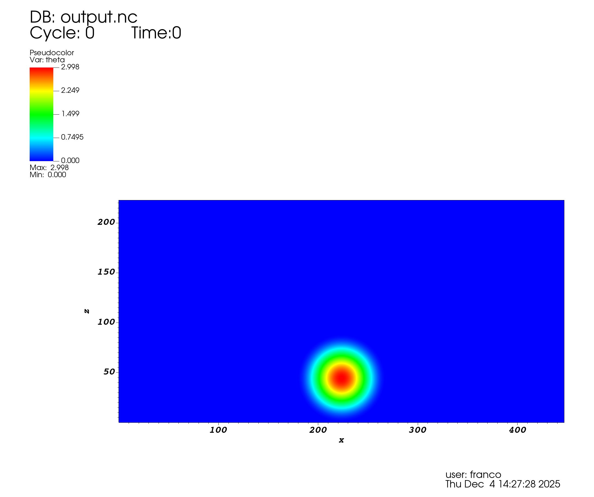
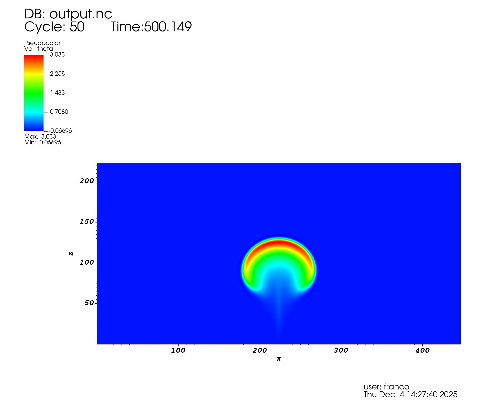
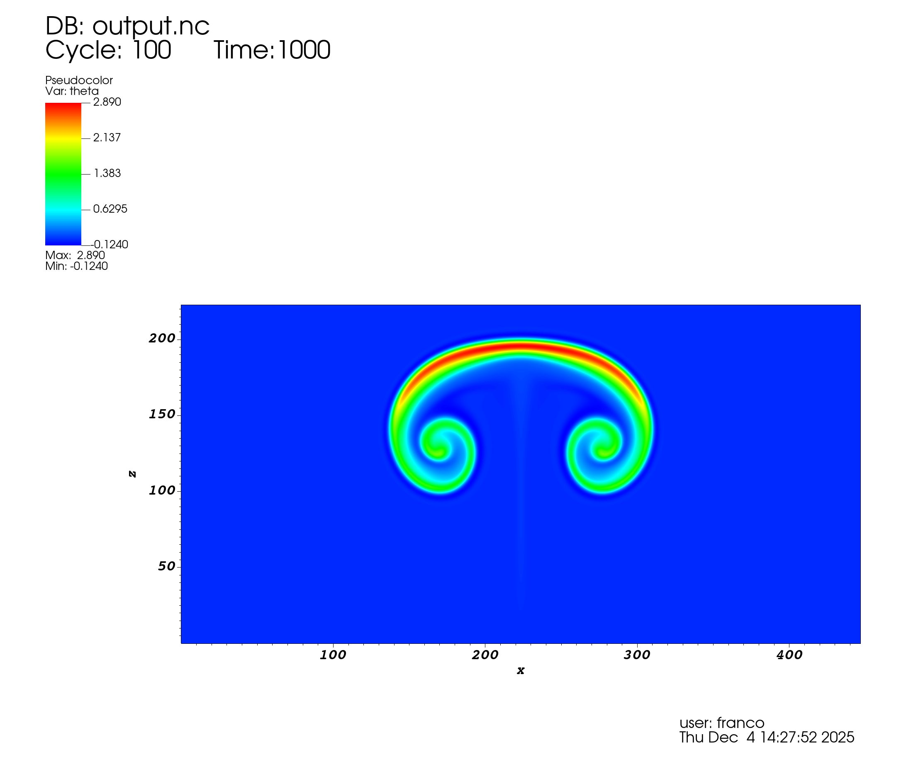

# miniweather-heterogeneous-port

Heterogeneous CPU/GPU port of the **miniWeather** mini-app: MPI domain decomposition, OpenMP threading,
OpenACC offload, parallel NetCDF output, and a multi-GPU scaling study on **Leonardo Booster** (CINECA).

Coursework for *P1.8 — Best Practices in Scientific Software Development*, Master in High Performance
Computing (ICTP / SISSA, Trieste), Nov–Dec 2025.

<p align="center">
  
  
  
</p>

## About

The model solves the 2-D inviscid Euler equations for a stratified compressible atmosphere — a rising
thermal in hydrostatic balance. Finite-volume spatial discretisation with fourth-order flux
interpolation, dimensional splitting, three-stage Runge–Kutta time integration, and fourth-order
hyperviscosity for stability. The physics is documented in [`code/Readme.md`](code/Readme.md).

**The solver is not ours.** It is [**miniWeather**](https://github.com/mrnorman/miniWeather) by
Matthew R. Norman (ORNL 2018, NVIDIA 2021), a mini-app written for parallel-programming training,
used here under its BSD licence ([`code/serial/LICENSE`](code/serial/LICENSE)).

What this repository adds:

- **Modular refactor** of the original single-file code into typed Fortran modules
- **MPI** domain decomposition in *x* with halo exchange
- **OpenMP** threading of the tendency stencils
- **OpenACC** GPU offload with explicit device data management and multi-GPU rank→device mapping
- **Parallel NetCDF** output — per-rank hyperslab writes into one shared file
- **CMake**, Docker and Singularity builds
- **GitHub Actions CI** running the regression suite in a container on every push and pull request
- **Doxygen** documentation
- **Instrumentation** — an MPI-wide per-routine timing framework, NVTX ranges, Nsight Systems traces
  and `perf` counters

## Results

Leonardo Booster, grid 2000 × 1000, `dt` = 0.0333 s. NVIDIA A100 (`cc80`), NVHPC 24.5, HPC-X MPI 2.19,
netcdf-fortran 4.6.1, built `-fast -acc -gpu=cc80`.

| GPUs | Nodes × ranks | Runtime | vs 1 GPU | Efficiency |
|---:|:---|---:|---:|---:|
| 1 | 1 × 1 | 49.9 s | 1.00× | 100% |
| 4 | 1 × 4 | 21.1 s | **2.37×** | 59% |
| 8 | 2 × 4 | 16.4 s | 3.04× | 38% |
| 12 | 3 × 4 | 16.7 s | 2.99× | 25% |
| 16 | 4 × 4 | 17.1 s | 2.92× | 18% |

Scaling saturates past 8 GPUs: the per-device subdomain becomes small enough that halo exchange and
kernel launch overhead dominate the shrinking compute. Against the best CPU configuration — 8 nodes,
128 MPI ranks × 2 OpenMP threads, 256 cores, **~67.4 s** — one A100 is 1.35× and four are **3.2×**.

> **Normalisation.** The CPU baseline ran to `final time = 1000` and the GPU runs to `500`. The CPU wall
> time of 134.7 s is halved above so the comparison is like-for-like. Raw logs are in
> [`code/results/gpu/`](code/results/gpu/) — `best_cpu.init` and `multigpu_scaling_*.init`.

<p align="center">
  
  
</p>

`perf stat` on the CPU build: 2.40 instructions/cycle, 3.01% L1-d miss rate, 3.06% LLC miss rate, and
**74.6% bad speculation** — the dominant stall. Full counters in
[`perf_results/base_perf.txt`](perf_results/base_perf.txt).

GPU offload only pays off at production grid sizes. On a small 100 × 50 domain the CPU build is faster,
because kernel launch and transfer overhead swamp the available work — see the sample output below.

## Repository layout

```
code/
  serial/          model source, CMake project, SLURM scripts, Doxygen config
    build/         generated during build; doc/html/ holds the rendered documentation
  results/         plots, run logs, Nsight traces
perf_results/      CPU performance counter statistics
.github/workflows/ci.yml    containerised regression tests
Dockerfile         build and run environment
runenv.sh          initialise the containerised environment
requirements.txt   Python packages for the output comparison test
```

### Source

| File | Contents |
|---|---|
| `model.F90` | Main driver — initialisation, RK time stepping, diagnostics |
| `module_physics.f90` | Initial and boundary conditions, numerical solution, mass and energy budgets |
| `module_types.F90` | Atmospheric state, flux and tendency types; halo exchange |
| `module_parameters.f90` | Domain decomposition and solver parameters, physical constants |
| `module_output.F90` | Parallel NetCDF output |
| `parallel_timer.f90` | Per-routine timing reduced across all ranks — total, max, average, call count |
| `module_nvtx.f90` | NVTX range annotations for Nsight Systems |

## Build and run

Requires `cmake`, `gfortran`, `libmpich-dev`, `libnetcdff-dev`, `python3`, `build-essential`, plus
`doxygen` and `graphviz` for documentation (Ubuntu 22.04 package names). Add the CUDA toolkit and
drivers for GPU offload. Alternatively `./runenv.sh` provides all of it in a Docker container.

```bash
cd code/serial && mkdir build && cd build
cmake ..                      # MPI + OpenMP
cmake .. -DUSE_OPENACC=ON     # MPI + OpenACC, on a system with GPUs
make -j4
make test                     # regression comparison against reference output
make doc                      # optional; open build/doc/html/index.html
```

Run the executable directly with grid points in *x*, number of timesteps, and output frequency:

```bash
mpirun -n 4 ./model 100 1000 10
```

This writes `output.nc` alongside the executable — view it with `ncview` or VisIt.

### Testing

`make test` runs `nccmp3.py`, which compares the generated output against two reference files and
reports, per variable, the ratio of the run-to-reference difference to the difference between the
references. Ratios below 2.0 pass. The same suite runs in CI on every push and pull request.

```bash
python3 nccmp3.py output-serial.nc output-serial-optimized.nc output.nc
```

```
Var Name            :  |1-2|                 ,  |2-3|                 ,  |2-3|/|1-2|
rho                 :      1.4099532998e-25  ,      1.5196072173e-25  ,      1.0777713116e+00
u                   :      8.3295645703e-27  ,      9.2624723271e-27  ,      1.1119995828e+00
w                   :      5.0759644567e-27  ,      7.2049604373e-27  ,      1.4194268890e+00
theta               :      2.0989239882e-26  ,      2.1411913543e-26  ,      1.0201376355e+00
TEST PASSED.
```

<details>
<summary><b>Sample run output</b> — 4 ranks × 2 threads, 100 × 50 grid</summary>

```
 ================= Execution Info ==================
  Number of MPI tasks:    4
  Number of OpenMP threads:    2
   OpenMP: ENABLED
   OpenACC: DISABLED
 ===================================================
 --------------- Domain Decomposition --------------
  Global nx:    100
  Local nx per process: ~    25
 ---------------------------------------------------
 ----------------- Atmosphere check ----------------
 Fractional Delta Mass  :   -6.0578657789430107E-015
 Fractional Delta Energy:    1.0051785904252513E-004
 ---------------------------------------------------
 PARALLEL TIMING STATISTICS (Microseconds)
                      Function      Max Total       Max Excl      Avg Total     Calls
                          INIT        3778.42         685.63        3758.13         4
          Computation: thermal        3118.97        1623.71        3089.61     57228
Computation: hydrostatic_const        1587.39        1587.39        1555.97     57228
Computation: total_mass_energy         281.50         104.25         217.03         8
            MPI: Communication       73227.01       73227.01       72265.45     18020
       Computation: rungekutta      415414.62        1440.36      415298.07      6004
             Computation: step      414268.06      343668.06      414068.18     36024
 * Max Total/Excl: The slowest rank for that function.
 * Avg Total: Average wall time across all ranks.
USED CPU TIME:              0.416140 seconds
```

The mass and energy diagnostics are the correctness check: fractional mass change stays at round-off,
and the energy drift is set by the hyperviscosity coefficient.

</details>

## Running on Leonardo

SLURM scripts: `code/cpu_model.sh`, `code/gpu_model.sh`, and in `code/serial/` — `batch.sh`,
`gpu_batch.sh`, `gpu.sh`, `nvtx_batch.sh` (Nsight profiling) and `submit_sweep.sh` (scaling sweep).

Upload with, substituting your own scratch path:

```bash
rsync -arvzP code leo:/leonardo_scratch/large/userexternal/<username>
```

<details>
<summary><b>Module environments</b></summary>

**MPI + OpenMP**

```bash
module purge
module load cmake/3.27.9
module load gcc/12.2.0
module load openmpi/4.1.6--gcc--12.2.0-cuda-12.2
module load netcdf-fortran/4.6.1--openmpi--4.1.6--gcc--12.2.0-spack0.22
```

**MPI + OpenACC**

```bash
module purge
module load cmake/3.27.9
module load nvhpc/24.5
module load hpcx-mpi/2.19
module load netcdf-fortran/4.6.1--hpcx-mpi--2.19--nvhpc--24.5
module load binutils/2.42
```

**Python, for the comparison test**

```bash
module purge
module load python/3.11
module load gcc/12.2.0
module load openmpi/4.1.6--gcc--12.2.0-cuda-12.2
module load netcdf-c/4.9.2--openmpi--4.1.6--gcc--12.2.0-spack0.22
module load parallel-netcdf/1.12.3--openmpi--4.1.6--gcc--12.2.0-spack0.22

python3 -m venv pyenv
pyenv/bin/pip install numpy netCDF4
pyenv/bin/python nccmp3.py output-serial.nc output-serial-optimized.nc output.nc
```

</details>

## Authors

[@RaionG18](https://github.com/RaionG18) — Emilio Gordillo ·
[@formidablefrank](https://github.com/formidablefrank) — J. Franco Ray ·
[@prabhkodes](https://github.com/prabhkodes) — Prabhsharan Singh

Developed over 155 commits and 40 reviewed pull requests on a `feature → dev → main` branch model.

## Licence

miniWeather is BSD-licensed by Oak Ridge National Laboratory and NVIDIA — see
[`code/serial/LICENSE`](code/serial/LICENSE). Modifications in this repository are released under the
same terms.
